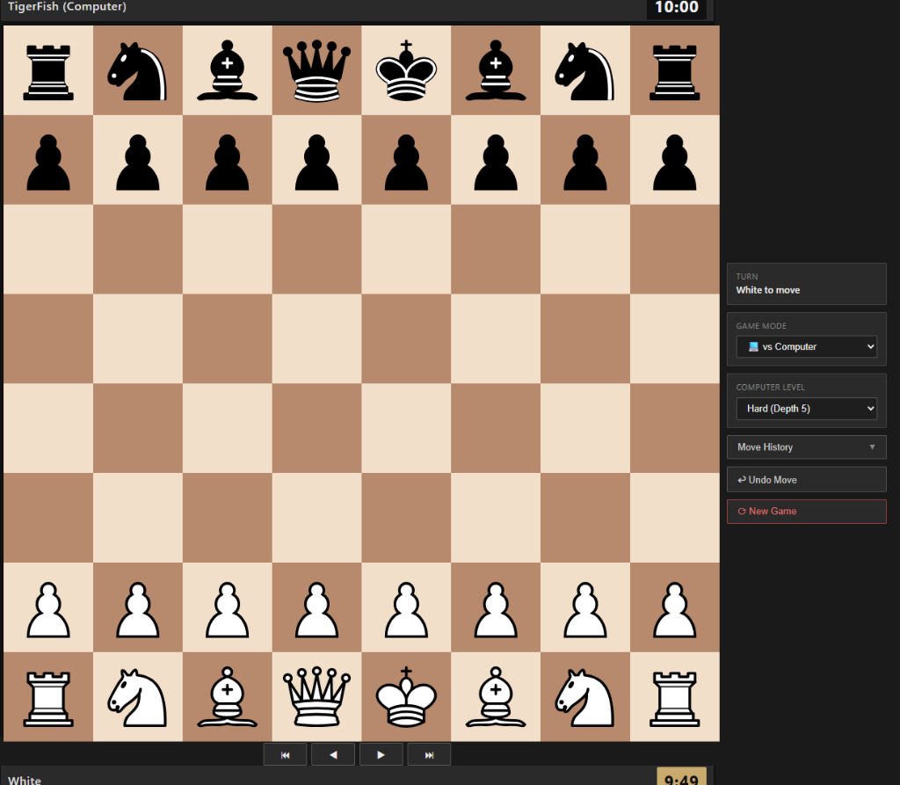
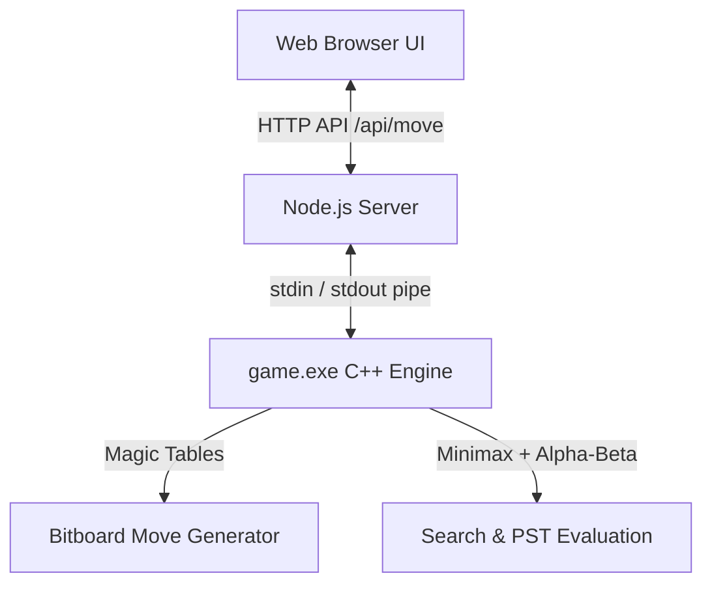

# 🐅 TigerFish Chess Engine



TigerFish is a high-performance, lightweight chess engine written in **C++20** with a modern **Node.js** web interface. Inspired by Stockfish, TigerFish leverages advanced bitboard representations, magic move generators, and minimax search optimizations to deliver tactically sharp chess in sub-millisecond response times.

---

## ⚡ Performance Benchmarks

TigerFish features a micro-optimized bitboard move generator evaluated across massive position datasets:

* **Throughput**: **~2.85 Million positions / second** under real-world cold-cache search conditions.
* **Average Speed**: **~350 nanoseconds** per full legal move generation call (tested on **10 Million random positions**).
---

## 🏗 Architecture & Design

TigerFish is split into a high-performance C++ calculation engine and a lightweight Node.js/JavaScript frontend wrapper.



### 1. Persistent Subprocess Pipeline (No Startup Lag)
Unlike standard engines that spawn a process per turn, TigerFish launches `game.exe` once at server boot in **interactive mode**. 
* The engine precomputes its 841KB of magic tables **exactly once** on startup.
* The Node.js backend queues requests sequentially, piping FEN strings and commands directly to the engine's `stdin` and parsing evaluations from `stdout`.
* Uses modern Node.js **WHATWG `URL` API** for high-security, standardized HTTP route parsing.
* Eliminates process startup overhead, bringing move verification and calculation response times down to **less than 10 milliseconds**.

### 2. C++ Engine Core Techniques
* **Bitboard Board Representation**: Uses 64-bit unsigned integers (`uint64_t`) for piece locations and board occupancy, allowing moves and attacks to be evaluated with fast bitwise CPU instructions.
* **Raw 32-Bit Move Packing**: Moves are lightweight `uint32_t` integers with zero struct allocation overhead.
* **Magic Bitboards**: Sliding piece movements (Rooks, Bishops, Queens) are generated instantly using magic multipliers and pre-computed blocker lookup tables.
* **Minimax Search with Alpha-Beta Pruning**: Recursively searches the game tree to a designated depth, pruning branches that cannot affect the final outcome.
* **Enhanced Rule Engine**: Full FIDE rule support including 50-move / 75-move rules, checkmate, stalemate, and enhanced **insufficient material detection** (including same-colored bishop pairs from underpromotions).
* **Tactical Threshold Randomization**: To keep games varied and avoid repetitive, robotic play, the engine builds a candidate pool of moves within a **50 centipawn threshold** (0.5 pawn value) of the top evaluation and selects dynamically among them.

### 3. Frontend & User Experience (UX)
* **Offline Instantly-Responsive Undo**: Board history (FEN, grid, last move) is cached in-memory on the client, allowing move takebacks with zero network latency.
* **Interactive History Browsing**: Click any past move in the sidebar or use the **Left/Right Arrow keys** to step backward and forward through game history.
* **Chess.com-Style Material Bar**: Computes net captured pieces and renders them as clean SVG icons next to the active player's bar, complete with a score advantage bubble (e.g., `+3`).
* **Dynamic Board Orientation**: In Local 2-Player matches, the board automatically flips on Black's turn so both players view the game from their perspective. In vs-Computer mode, the board remains fixed from White's perspective.

---

## 🚀 Getting Started

### Prerequisites
* A C++ compiler supporting C++20 (e.g., `g++` 10+)
* [Node.js](https://nodejs.org/) (v16+)

### 1. Compile the C++ Engine
Compile the engine source code with high optimization flags from the repository root:
```bash
g++ -O3 -std=c++20 engine/main.cpp -o game.exe
```

### 2. Start the Server
Launch the Node.js server to run the web interface:
```bash
node server.js
```

### 3. Play the Game
Open your web browser and navigate to:
```
http://127.0.0.1:5000
```

---

## 🏗️ 5-Layer Pyramid Architecture

```
 ┌────────────────────────────────────────────────────────┐
 │                    LAYER 5: ENGINE                     │
 │  File: search.cpp, main.cpp                            │
 │  Classes: Engine, main() CLI entry point               │
 │  Functions: evaluate(), minimax(), best_move()         │
 └───────────────────────────┬────────────────────────────┘
                             │ depends down on
                             ▼
 ┌────────────────────────────────────────────────────────┐
 │            LAYER 4: MOVE GENERATION & RULES            │
 │  File: rules.cpp                                       │
 │  Classes & Structs: MoveGenerator, MoveList, PinInfo   │
 │  Free Functions: is_in_check(), get_game_result(),     │
 │                  is_insufficient_material()            │
 └───────────────────────────┬────────────────────────────┘
                             │ depends down on
                             ▼
 ┌────────────────────────────────────────────────────────┐
 │                 LAYER 3: BOARD STATE                   │
 │  File: board.cpp                                       │
 │  Class: Board                                          │
 │  Functions: make_move(), unmake_move(), set_fen(),    │
 │             print_board(), get_ray(), to_fen()         │
 └───────────────────────────┬────────────────────────────┘
                             │ depends down on
                             ▼
 ┌────────────────────────────────────────────────────────┐
 │            LAYER 2: 32-BIT MOVE PACKING                │
 │  File: board.cpp                                       │
 │  Functions: pack_move(), move_from_sq(),               │
 │             move_to_sq(), move_to_uci()                │
 └───────────────────────────┬────────────────────────────┘
                             │ depends down on
                             ▼
 ┌────────────────────────────────────────────────────────┐
 │          LAYER 1: ENUMS, MASKS & LOOKUP TABLES         │
 │  Files: board.cpp, magic_lut.cpp, eval_lut.cpp         │
 │  Enums: Piece, Color, Direction, CastleRights,         │
 │         GameResult                                     │
 │  Tables: ray_table, PST arrays, Magic Bitboards        │
 └───────────────────────────┴────────────────────────────┘
```

## 📁 Repository Structure
```
├── engine/                 # C++20 5-Layer Chess Engine Source
│   ├── board.cpp           # Layer 2 & 3: Board state, 32-bit Move packing, FEN parser
│   ├── rules.cpp           # Layer 4: MoveGenerator, MoveList, Rules (check, checkmate, draw)
│   ├── search.cpp          # Layer 5: Minimax search & position evaluation (Engine)
│   ├── main.cpp            # Layer 5: CLI interface & interactive persistent mode
│   ├── magic_lut.cpp       # Layer 1: Precomputed magic bitboard lookups
│   └── eval_lut.cpp        # Layer 1: Evaluation tables (PIECE_VALUE, PST)
├── index.html              # Frontend Chessboard UI
├── server.js               # Node.js backend API (Port 5000)
├── game.exe                # Compiled C++ Engine Binary
├── OPERATIONS_MANUAL.md    # Comprehensive technical & architectural reference manual
└── README.md               # You are here!
```
