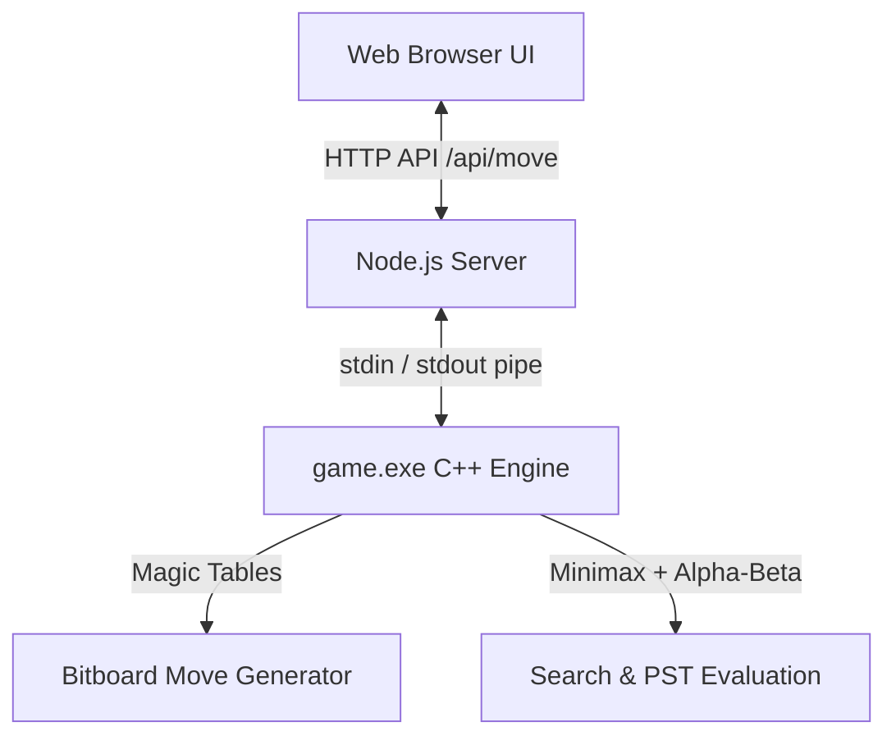

# 🐅 TigerFish Chess Engine

TigerFish is a high-performance, lightweight chess engine written in **C++20** with a modern **Node.js** web interface. Inspired by Stockfish, TigerFish leverages advanced board representations, bitwise move generators, and minimax search optimizations to deliver tactically sharp chess in sub-millisecond response times.

---

## 🏗 Architecture & Design

TigerFish is split into a high-performance C++ calculation engine and a lightweight Node.js/JavaScript frontend wrapper.



### 1. Persistent Subprocess Pipeline (No Startup Lag)
Unlike standard engines that spawn a process per turn, TigerFish launches `game.exe` once at server boot in **interactive mode**. 
* The engine precomputes its 841KB of magic tables **exactly once** on startup.
* The Node.js backend queues requests sequentially and pipes FEN strings and commands directly to the engine's `stdin` and reads evaluations from `stdout`.
* This eliminates the 3-second magic table calculation overhead per move, bringing move verification and calculation times down to **less than 10 milliseconds**.

### 2. C++ Engine Core Techniques
* **Bitboard Board Representation**: Uses 64-bit unsigned integers (`uint64_t`) to represent the board layout. This allows board states, piece occupancies, and check masks to be evaluated using fast bitwise CPU instructions.
* **Magic Bitboards**: Sliding piece movements (Rooks, Bishops, Queens) are generated instantly using magic multipliers and pre-computed blocker lookup tables.
* **Minimax Search with Alpha-Beta Pruning**: Recursively searches the game tree to a designated depth, pruning branches that cannot affect the final outcome to accelerate calculation speed.
* **Piece-Square Tables (PST)**: Beyond raw material values (Pawn=100, Knight/Bishop=300, Rook=500, Queen=900), the engine uses position tables to encourage pieces to take active squares (e.g. Knights toward the center, Kings castled safely, Pawns marching forward).
* **Tactical Threshold Randomization**: To keep games varied and avoid repetitive, robotic play, the engine builds a candidate pool of moves within a **50 centipawn threshold** (0.5 pawn value) of the absolute best evaluation and selects randomly from them. It will never play blunders but remains highly creative in open positions.

### 3. Frontend & User Experience (UX)
* **Offline Instantly-Responsive Undo**: Board history (FEN, grid, last move) is cached in-memory on the client, allowing you to undo moves instantly with **zero network latency**.
* **Interactive History Browsing**: Click any past move in the sidebar or use the keyboard **Left/Right Arrow keys** to step backward and forward through the game.
* **Chess.com-Style Material Bar**: Computes net captured pieces (cancelling out identical trades) and renders them as clean SVG icons next to the active player's bar, complete with a dark-pill score advantage bubble (e.g., `+3`).
* **Dynamic Board Orientation**: In Local 2-Player matches, the board automatically flips on Black's turn so both players view the game from their own perspective. In vs-Computer mode, the board remains fixed from White's perspective.

---

## 🚀 Getting Started

### Prerequisites
* A C++ compiler supporting C++20 (e.g., `g++` 10+)
* [Node.js](https://nodejs.org/) (v16+)

### 1. Compile the C++ Engine
Compile the engine source code with high optimization flags from the repository root:
```bash
g++ -O3 -std=c++20 engine/game.cpp -o game.exe
```

### 2. Start the Server
Launch the Node.js server to run the web interface:
```bash
node server.js
```

### 3. Play the Game
Open your web browser and navigate to:
```
http://127.0.0.1:8080
```

---

## 📁 Repository Structure
```
├── engine/                 # C++20 Chess Engine Source
│   ├── chess.cpp           # Board structure & FEN parser
│   ├── game.cpp            # Main C++ engine entry point
│   ├── magic_lut.cpp       # Precomputed magic numbers lookup
│   ├── move_finder.cpp     # Minimax search & evaluation
│   ├── move_generator.cpp  # Bitboard move generator
│   └── pst_lut.cpp         # Piece-Square Tables (PST) lookup
├── archive/                # Older binary backups (Ignored by Git)
├── index.html              # Frontend Chessboard UI
├── server.js               # Node.js backend API
├── .gitignore              # Git ignored files & folders
└── README.md               # You are here!
```
